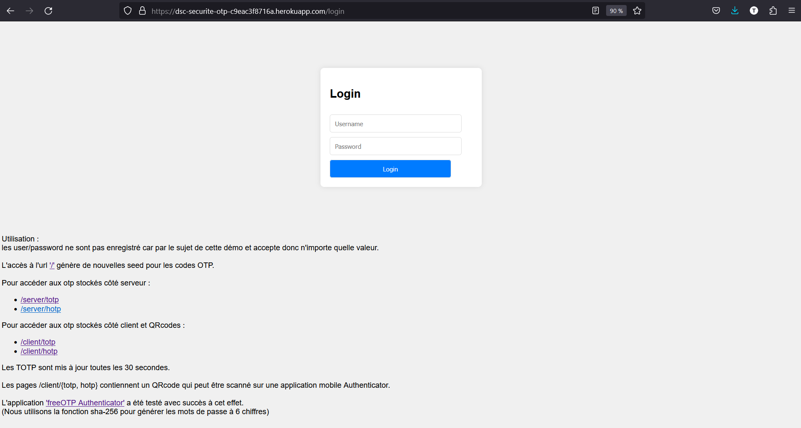
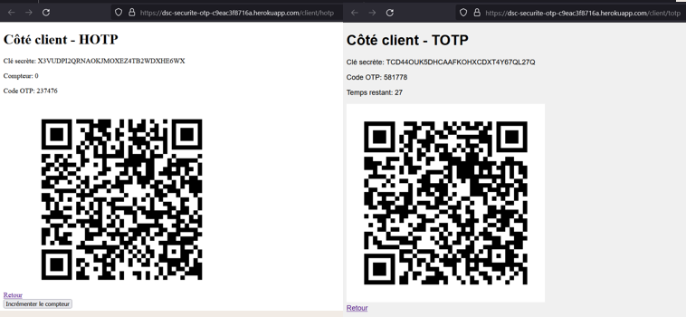
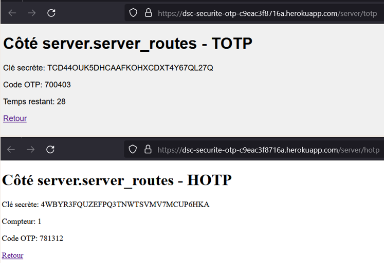
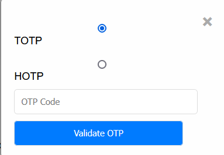
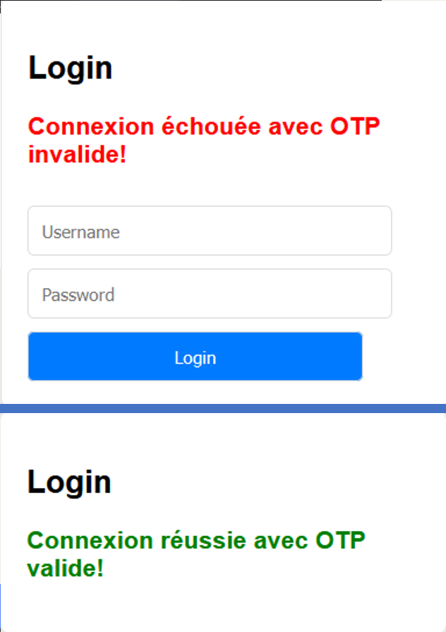

# Prototype de client-serveur pour le protocole OTP réalisé en python pour le cours de cryptographie de M2 informatique

Live demo availible on heroku at : https://dsc-securite-otp-c9eac3f8716a.herokuapp.com


## Table of contents

- [How to use it ?](#how-to-use-it-)
- [App illustrations](#app-illustrations)

  - [Home page](#home-page)
  - [Client pages](#client-pages)
  - [Server pages](#server-pages)
  - [OTP pop-up](#otp-pop-up)
  - [OTP validation](#otp-validation)

- [Installation](#installation)
- [launch](#launch)
  
  - [localhost with python](#localhost-with-python)
  - [using a gunicorn server](#using-a-gunicorn-server)


## How to use it ?

The root url '/' is used to generate new seed for both HOTP and TOTP methods as well as reinit the HOTP counter.

Then you are redirected to the home page where you can find instructions to navigate among the different pages.

Using an authenticator app is not mandatory but advice for otp thus in the /client/* pages you can find a QRcode compliant with authenticator app as  freeOTP (which as been tested on)

If you interestead about the otp protocol please find attach to this repot a [pdf report](doc/rapport.pdf) about it (in french).

Whithout further ado, please enjoy some screenshots of the app.

## App illustrations

### Home page



### CLient pages



### Server pages




### OTP pop-up



### OTP validation



## Installation

Download project's dependencies with pip:

```bash
pip install -r requirements.txt
```

## launch

### localhost with python

```bash
python3 app/app.py
```

 availible at url : localhost:5000

### using a gunicorn server

```bash
gunicorn app:app --chdir app
```

availible at url : localhost:8000
